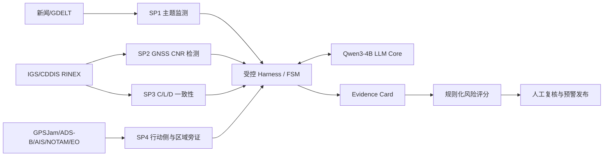
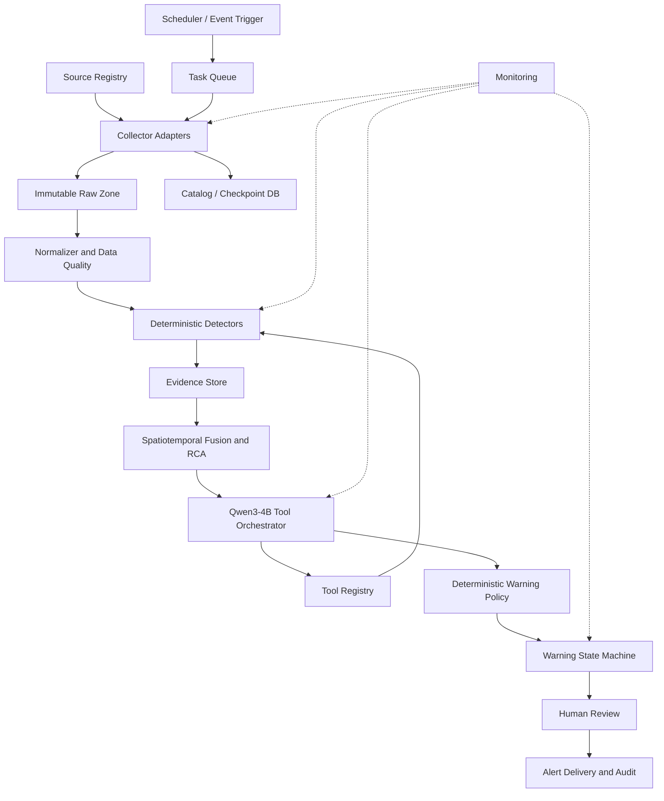

# Qwen3-4B 多源异动预警 Agent 构建情况总结

最后更新：2026-08-07

## 1. 总体结论

当前已经形成一个以 Qwen3-4B 为 LLM Core 的受控预警与根因分析原型，能够在离线案例中完成：

1. 读取新闻主题、GNSS、ADS-B 派生指标等前端工具报告；
2. 按有限状态机选择下一阶段工具；
3. 组织支持证据、反证和限制条件；
4. 生成结构化 evidence card 和中文研判摘要。

但当前系统仍属于**离线案例回放型原型**，尚不是持续运行的在线预警 Agent。最主要的缺口不是 Qwen3-4B 模型本身，而是：

- 尚无持续运行的自动数据采集前端；
- 原始 ADS-B、逐船 AIS、NOTAM 等行动侧数据尚未稳定接入；
- GNSS 下载、解析和异常检测尚未完整编入统一在线流水线；
- 工具选择仍以预设阶段为主，Agent 自主编排能力有限；
- 证据 schema、状态存储、阈值冻结、无前视回测和告警状态机尚未生产化；
- 模型服务缺少守护、健康检查、自动恢复和运行监控。

工程完成度估计：

| 目标层级 | 当前完成度 | 判断 |
|---|---:|---|
| 案例演示闭环 | 约 65%–70% | 已有可复核运行产物，能够生成受约束证据卡 |
| 通用多模态 Agent | 约 40% | 已有核心概念与部分工具，但接口、状态和数据流尚未统一 |
| 生产级在线预警系统 | 约 30% | 自动采集、回测、告警治理、运行保障仍是主要缺口 |

以上比例是基于当前代码、案例产物和运行状态的工程估计，不是模型精度指标。

## 2. 设计原则与 Qwen3-4B 定位

系统坚持将 LLM Core 与确定性信号处理解耦：

```text
原始数据 -> 确定性处理工具 -> 结构化异常证据 -> Qwen3-4B 编排
        -> 规则化风险评分 -> evidence card -> 人工复核/预警发布
```

Qwen3-4B 适合承担：

- 读取短小、结构化的工具报告；
- 在允许工具集合内选择下一步动作和参数；
- 判断是否需要扩大范围、补充数据或执行反证；
- 汇总支持项、反证项、置信度、限制和下一步建议；
- 生成结构化 evidence card 与自然语言摘要。

Qwen3-4B 不应承担：

- 直接读取或计算大规模 RINEX、ADS-B、AIS 原始数据；
- 自行定义信号异常阈值；
- 单独推断干扰源、欺骗源、军事行动主体或因果关系；
- 绕过确定性规则直接发布高等级预警；
- 将数据缺失解释为没有事件发生。

Qwen3-4B 应作为系统的**控制平面和解释层**，而不是信号检测器或最终授权判决器。

## 3. 当前体系结构



其中，SP Tool 输出数值、时间窗、空间范围、质量标志和限制条件；Qwen3-4B 只读取这些报告，不直接替代信号处理算法。

## 4. 已完成或已验证的能力

### 4.1 Qwen3-4B 推理服务

已在 SRIBD 服务器上完成过单卡 vLLM 部署：

- 模型：Qwen3-4B；
- 服务协议：OpenAI-compatible API；
- served model name：`qwen3-4b`；
- 默认端口：`8000`；
- GPU：单张 NVIDIA RTX A5000；
- 最大上下文配置：8192 tokens；
- 推理类型：BF16。

历史日志证明服务曾成功处理多轮 `/v1/chat/completions` 请求。2026-08-07 巡检时，原服务进程已经退出、API 不可用，两张 A5000 均空闲；模型、Conda 环境和历史日志仍保留。最后一批明确的 Agent 请求日志位于 2026-07-09。

### 4.2 新闻抽取与主题监测

已形成 mini-GDELT/Qwen 抽取和主题监测脚手架，能够将标题、URL、元数据和摘要转换为项目事件 schema。

已有运行结果：

| 运行 | 输入文章 | 成功 | 失败 |
|---|---:|---:|---:|
| Smoke test | 1 | 1 | 0 |
| Hormuz shipping limit-5 | 5 | 5 | 0 |
| Kharkiv strict loop | 6 | 3 | 3 |

这表明结构化抽取已可用于原型，但对页面可访问性、正文质量、JSON 稳定性和失败恢复仍需加强。

### 4.3 GNSS 地面观测工具

已经完成或部分完成：

- IGS/CDDIS RINEX/CRINEX 索引和下载 Skill；
- CNR/CN0 基线对比和低尾异常指标；
- 多站同步异常检查；
- 载波相位、伪距、多普勒的 C/L/D 一致性分析；
- Kharkiv、Hormuz/Iran、Venezuela 等案例的不同强度验证；
- 正证据、反证和限制条件的结构化输出。

当前限制是：下载 Skill 与分析脚本可以按需运行，但尚未成为持续调度、增量处理的统一数据前端；严格循环中仍有步骤直接读取预计算结果。

### 4.4 ADS-B、AIS、GPSJam 与 EO 旁证

当前已使用或探索：

- GPSJam 日度 H3 网格，作为 ADS-B 派生的导航质量 proxy；
- IMF PortWatch 与 WTO–AXSMarine 的 AIS 派生公开聚合指标；
- Sentinel-1/2 探索性海事旁证；
- AISStream/AISHub 等实时连接思路。

当前尚未形成稳定主判据的部分：

- 原始 ADS-B 逐航班轨迹；
- 逐船历史 AIS；
- NOTAM/NAVTEX 实时与历史数据；
- 可长期运行的 AIS/ADS-B live collector；
- GPSJam 与地面 IGS 异常的自动时空同步检验；
- 独立证据家族计票和同源依赖消解。

GPSJam 是 ADS-B 派生 proxy，不能替代原始轨迹，也不能单独证明军用压制式干扰。PortWatch 与 WTO 指标均依赖 AIS，不应被重复计为两项独立物理证据。

### 4.5 受控 Harness 与 Evidence Card

已实现的严格循环包含以下阶段：

```text
TOPIC_MINING
  -> CNR_DETECTION
  -> CLD_CORRELATION
  -> MOBILITY_CHECK
  -> EVIDENCE_CARD
```

Kharkiv 严格回放已经生成：

- 工具决策记录；
- 结构化工具证据；
- Agent trace；
- 最终 evidence card；
- Markdown 研判报告。

该回放的最终结论为 `signal_side_event_stress_only`，置信度为 `low_to_medium`。结果明确保留了“未形成严格多站 C/L/D 一致性、行动侧数据不可用、不能证明干扰/欺骗/来源/因果”的边界。

## 5. 当前本质：下载工具，而非自动采集前端

当前典型流程仍是：

```text
人工指定事件、区域和时间窗
  -> 运行一次性下载脚本
  -> 保存 RINEX/CSV/JSON/影像资产
  -> 运行分析脚本
  -> Qwen3-4B 读取结果
```

已有组件可以“抓到数据”，但系统还缺少自动数据前端应具备的下列能力：

- 数据源注册与配置中心；
- 定时调度和事件触发；
- 增量时间游标、水位线和断点续传；
- 任务队列、并发控制、重试、退避和限流；
- 原始数据不可变存储与 manifest；
- UTC、坐标、网格、字段和单位标准化；
- 数据去重、覆盖率检查、质量控制和来源健康监控；
- 新数据到达后自动触发异常检测；
- 供 Agent 查询“有什么数据、更新到何时、质量如何”的 Catalog API。

因此，当前原型可以回放历史案例，但不能持续回答“最近 15 分钟某区域是否出现了新的多源同步异常”。

## 6. 尚缺的规范化模块

| 模块 | 状态 | 主要缺口 | 优先级 |
|---|---|---|---:|
| Model Serving | 部分完成 | 服务守护、健康检查、自动拉起、并发和超时治理 | P0 |
| Source Registry | 未完成 | 数据源、频率、区域、权限、依赖关系的统一登记 | P0 |
| Collector Adapters | 部分完成 | 统一 `fetch/status/checkpoint` 接口 | P0 |
| Scheduler / Queue | 未完成 | 定时采集、任务队列、重试、限流和幂等 | P0 |
| Raw Data Lake | 部分完成 | 统一目录、manifest、哈希、版本和保留策略 | P0 |
| Normalizer / QC | 部分完成 | 时间、空间、字段、单位、覆盖率和质量标志 | P0 |
| Evidence Schema | 部分完成 | 固化字段、来源血缘、可见时间和限制条件 | P0 |
| Evidence Store | 未完成 | 事件状态、证据版本、阈值版本和运行轨迹持久化 | P0 |
| Detection Tools | 部分完成 | GNSS 动态化；ADS-B/AIS/NOTAM 确定性检测器 | P0 |
| Spatiotemporal Fusion | 未完成 | 多源同步窗口、空间相交、独立性和置信度融合 | P0 |
| Counter-evidence/RCA | 部分完成 | 空间天气、设备故障、覆盖下降、发布滞后自动反证 | P0 |
| Agent Tool Registry | 部分完成 | 多候选工具、参数约束、调用预算、停止与降级策略 | P1 |
| Warning FSM | 未完成 | 监控、关注、预警、严重、解除/驳回状态及升级规则 | P0 |
| Backtest/Evaluation | 未完成 | 无前视滚动回测、阈值冻结、虚警率、漏警率和提前量 | P0 |
| Human Review | 未完成 | 待审、批准、撤销、注释和一键回放 | P1 |
| Observability/Security | 未完成 | 指标、日志、trace、权限、密钥和审计 | P0 |

## 7. 目标在线架构



## 8. 建议的统一数据契约

每个确定性工具至少应输出：

```json
{
  "event_id": "stable-event-id",
  "source_family": "gnss_ground|adsb|ais|notam|news|space_weather|eo",
  "tool_name": "detector-name",
  "observed_at": "UTC timestamp",
  "available_at": "UTC timestamp",
  "geometry": {},
  "feature": "metric-name",
  "value": 0.0,
  "baseline": {},
  "anomaly_score": 0.0,
  "confidence": 0.0,
  "quality_flags": [],
  "provenance": {},
  "supporting_evidence": [],
  "counter_evidence": [],
  "limitations": []
}
```

`observed_at` 与 `available_at` 必须分开，避免将事后发布的数据错误回填为事前预警。证据融合还必须记录 `source_family`，防止多个同源派生产品被重复计票。

## 9. 推荐实施顺序

### P0：形成可持续运行的最小闭环

1. 恢复 Qwen3-4B 服务，增加 systemd/Docker 守护和健康检查；
2. 固化 `AnomalyEvidence`、`WarningEvent` 和工具调用 schema；
3. 建立 Source Registry、Scheduler、Queue、Checkpoint DB 和 Raw Zone；
4. 将 IGS/CDDIS 下载、RINEX 解析和 GNSS 检测接入增量流水线；
5. 接入一个行动侧实时源，优先 ADS-B 或 NOTAM；
6. 实现多源时空同步、来源独立性和自动反证；
7. 实现确定性风险评分与 Warning FSM；
8. 建立运行监控、失败告警和完整 trace。

### P1：形成可评估的试运行系统

1. 建立正例、弱例、负例和正常期数据集；
2. 实施无前视滚动回测并冻结阈值；
3. 统计虚警率、漏警率、提前量、可用率和置信度校准；
4. 接入逐船 AIS、原始 ADS-B、NOTAM/NAVTEX 和空间天气；
5. 增加人工复核、预警批准、撤销和审计回放界面；
6. 将本地实验脚本、schema 和运行测试迁入本仓库。

### P2：提高覆盖和 Agent 能力

1. 扩展 EO、港口、频谱和其他公开行动侧数据；
2. 允许 Qwen3-4B 在多个候选工具间受约束选择；
3. 增加区域扩展、站点重选、时间窗调整和预算管理；
4. 在保持规则化最终闸门的前提下优化摘要与反证选择。

## 10. 进入试运行的最低验收条件

系统至少应满足：

- 连续运行期间采集任务可自动调度、重试和断点恢复；
- 每条预警都能回溯到原始数据、工具版本、阈值版本和 Agent trace；
- 数据缺失、接口故障和覆盖下降不会被解释为正常状态；
- 单一弱来源不能直接触发高等级预警；
- 同源派生指标不会被重复计算为独立证据；
- 时间可见性严格遵循 `available_at`，禁止前视泄漏；
- 正例、负例和正常期均完成无前视回测；
- 高等级预警需要确定性策略通过并保留人工复核入口；
- Qwen 输出必须通过 JSON Schema 校验，失败时可降级为确定性流程；
- 模型服务、采集器、检测器和告警状态均有健康监控。

## 11. 当前仓库边界

本仓库目前主要包含：

- IGS/CDDIS 数据下载 Skill；
- Iran/Hormuz 多模态案例包及其数据源清单和派生结果；
- 项目进度与方法边界文档。

Qwen3-4B 的部分实验脚本、严格循环脚手架和历史运行产物目前仍位于本地实验工作区，尚未全部迁入本仓库。因此，仓库现状不能单独复现完整的 Qwen3-4B 严格循环。后续应优先迁移可复用源码、schema、最小测试数据和自动化测试，避免系统知识只存在于本地报告与运行目录中。

## 12. 最终判断

围绕 Qwen3-4B 的 Agent 已经证明了以下路线可行：

> 使用确定性工具处理原始多模态数据，让小型本地 LLM 负责受控编排、反证选择和解释输出，可以形成低成本、可审计的预警与 RCA 原型。

下一阶段的核心任务不是让 Qwen3-4B 直接处理更多原始数据，而是把数据采集、工具接口、状态存储、时空融合、规则引擎、回测和运行保障建设成稳定前端。完成这些基础模块后，现有 Qwen3-4B 才能从案例解释器升级为持续运行的规范预警 Agent。
